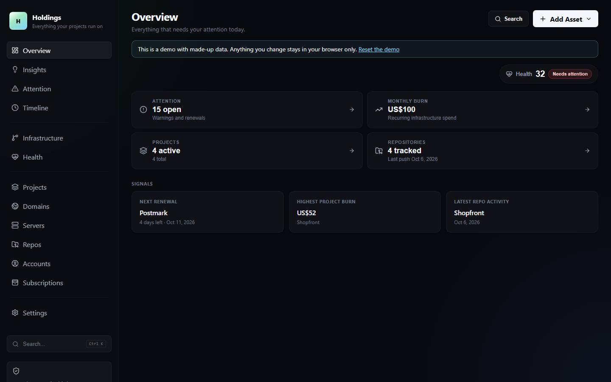
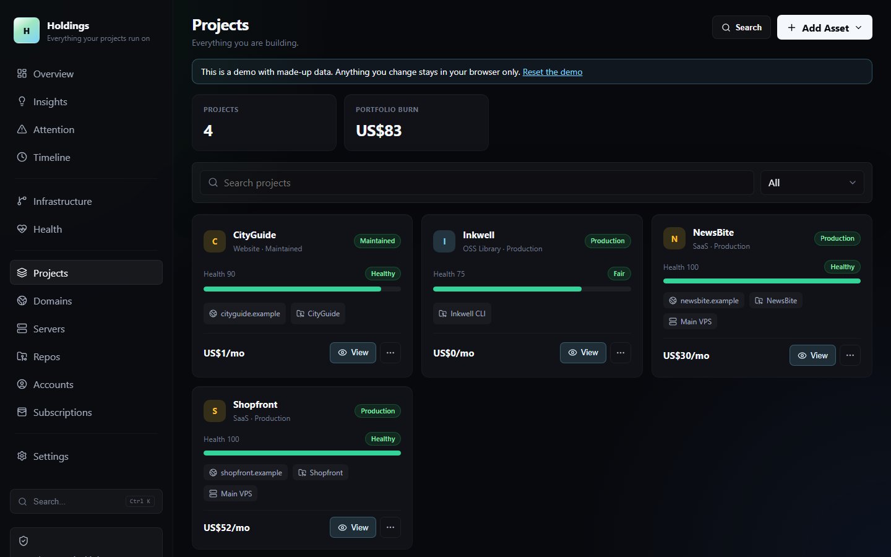
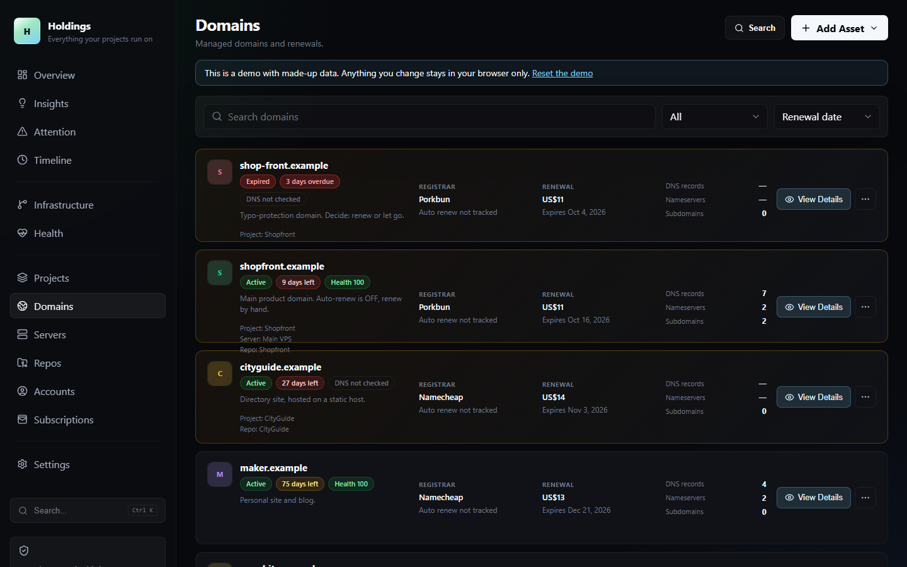
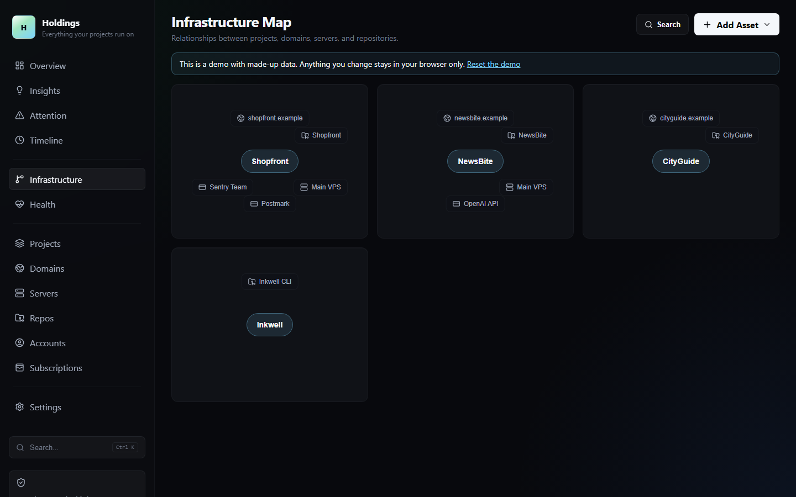

# Holdings

**Everything your side projects run on, in one place.** Domains, servers, repos, accounts and subscriptions, grouped by project, with what each project costs and what's about to expire.

[](https://github.com/chmuzamil/holdings/actions/workflows/ci.yml)
[](LICENSE)
-f59e0b)



If you run a handful of side projects, you probably have 20 domains at three registrars, a couple of VPSes, a pile of SaaS subscriptions and a dozen repos. They're spread across a spreadsheet, your inbox and your memory. Holdings puts them in one register, links each one to the project it belongs to, and tells you what that project costs per month and what renews next.

It runs entirely in your browser. No account, no tracking, no server required.

> **Status:** early. v0.1 is a working local-first tracker. The features that make Holdings different (see [Roadmap](#roadmap)) are being built for v0.2. Feedback and issues are very welcome.

## Who it's for

Solo founders and indie hackers with **several projects**, who want to answer questions like:

- What does each project cost me per month?
- What renews or expires in the next 30 days, and which project is it for?
- Which subscriptions aren't attached to anything any more?
- Which server does this domain point to, and which repo deploys there?

If you want a homelab start page, [Homepage](https://github.com/gethomepage/homepage) or [Homarr](https://github.com/homarr-labs/homarr) are better fits. If you want uptime monitoring, use [Uptime Kuma](https://github.com/louislam/uptime-kuma) or [Gatus](https://github.com/TwiN/gatus).

## What works today (v0.1)

- **Projects as the centre.** Link domains, servers, repos and subscriptions to a project and see its monthly cost.
- **Domains** with subdomains attached to servers, notes, renewal dates, and an optional live DNS + registry (RDAP) check: registrar, expiry, nameservers, MX and SPF.
- **Servers, repos, accounts and subscriptions** with costs, renewal dates and notes.
- **GitHub import**: fetch your repos by username. An optional token is kept in memory only, never saved.
- **Attention list and health score**: overdue and upcoming renewals, stale repos, domains never checked, unlinked assets.
- **Timeline** built only from real dates: when you added things, when repos were created, when domains were registered.
- **Costs in USD**, with an optional second display currency. Its rate is fetched daily from [ExchangeRate-API](https://www.exchangerate-api.com).
- **Command palette** (Ctrl/Cmd + K) to jump to anything.
- **Export and import** everything as JSON.
- **Demo mode** with a made-up portfolio, to look around before adding your own data.

| Projects | Domains | Infrastructure map |
| --- | --- | --- |
|  |  |  |

## Quick start

You need Node.js 22 or newer.

```bash
git clone https://github.com/chmuzamil/holdings.git
cd holdings
npm ci
npm run dev
```

Open http://localhost:5173. On first run you can add a project, load the demo data, or import a JSON export.

To use the live DNS/registry check, run the small lookup server in a second terminal. The dev server forwards `/api` to it.

```bash
npm run api
```

### Hosting it

`npm run build` produces static files in `dist/` that any web server can serve. `npm run build:demo` builds the public demo version. [docs/hosting-the-demo.md](docs/hosting-the-demo.md) has ready-to-use Caddy and nginx configs with a tested Content-Security-Policy. A one-command Docker setup with a small server is planned for v0.2.

## Your data and privacy

- Everything is stored in your browser's local storage. Nothing is sent to a server you don't run.
- Clearing site data deletes it, so use **Settings → Export JSON** for backups.
- The app only contacts other services when you ask it to:
  - `api.github.com`, when you fetch or refresh GitHub repos
  - `open.er-api.com`, once a day, if you picked a second currency
  - your own lookup server (`npm run api`), when you run a DNS check. It queries DNS, IANA's registry directory and the domain's public registry (RDAP).
- No analytics, no telemetry, no third-party scripts, fonts or icons.

## Why not…

| | Holdings | Wallos | Domain Locker | Uptime Kuma | Homepage | Coolify |
| --- | :---: | :---: | :---: | :---: | :---: | :---: |
| Domains, servers, repos, subscriptions in one place | ✅ | subscriptions | domains | – | links | apps it deploys |
| Grouped by project, with cost per project | ✅ | – | – | – | – | – |
| Renewal and expiry tracking | ✅ | ✅ | ✅ | domain expiry | – | – |
| Live DNS / registry check | ✅ | – | ✅ | – | – | – |
| Uptime monitoring | – | – | – | ✅ | status widgets | app health checks |
| Revenue per project | planned (v0.2) | – | – | – | – | – |
| "What breaks if…" impact view | planned (v0.2) | – | – | – | – | – |
| Handover and sale (due-diligence) packs | planned (v0.2) | – | – | – | – | – |
| API key and certificate expiry (metadata only) | planned (v0.2) | – | SSL | certs | – | – |
| Built-in MCP server for AI agents | planned (v0.2) | community | – | community | – | own apps only |
| Works with no server at all | ✅ | – | – | – | – | – |

These tools are great at what they do, and Holdings doesn't try to replace them. Keep Uptime Kuma for monitoring and Coolify for deploys. Holdings is the register of what you own and what it costs.

## Roadmap

**v0.2: the founder's asset register**
- **Project ledger**: monthly cost against revenue for each project (read-only Stripe, Lemon Squeezy, Paddle), with shared servers split fairly between projects.
- **"What breaks if…"**: pick a domain, server or card and see everything that depends on it, and the revenue at risk.
- **Expiry radar**: domains, TLS certificates, API keys, OAuth apps and card expiry dates in one list. Metadata only, never the secret.
- **Exit pack**: a one-click asset register and transfer checklist for selling a project.
- **Handover pack**: an encrypted "if I'm unavailable" document for someone you trust.
- **MCP server** (read-only by default), so Claude and other agents can answer questions about your portfolio.
- **Self-hosted mode**: one Docker container (Node + SQLite) with login, scheduled checks and notifications.

**v0.3**: dead-man's switch, domain risk score (registrar lock, DNSSEC, SPF/DKIM/DMARC), Uptime Kuma / Gatus status import, subscription clean-up suggestions, registrar and Cloudflare importers.

**Later**: verified backups via [BackupProof](https://github.com/chmuzamil/BackupProof), read-only second user.

## Development

```bash
npm run dev          # app with hot reload
npm run api          # DNS/registry lookup server on 127.0.0.1:4180
npm test             # unit tests (Vitest)
npm run lint         # ESLint
npm run build        # production build
npm run build:demo   # demo build with made-up data
```

CI runs lint, tests and a build on Node 22 and 24 for every pull request.

Optional environment variables are listed in [.env.example](.env.example).

## Contributing

Issues and pull requests are welcome. See [CONTRIBUTING.md](CONTRIBUTING.md). The one hard rule: **only fictional data in the repo.** Use `.example` domains and documentation IP ranges, never real ones.

To report a security problem, see [SECURITY.md](SECURITY.md).

## License

[MIT](LICENSE)
